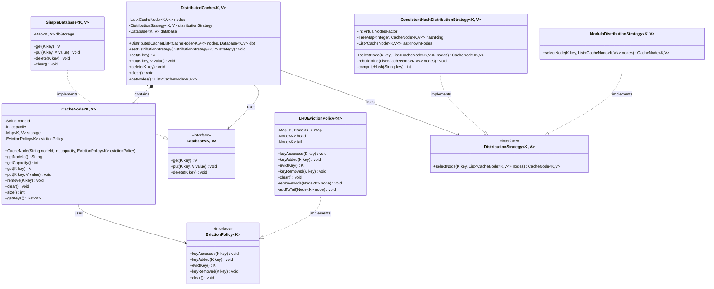

# Distributed Cache System UML Class Diagram

This document contains the UML Class Diagram for the Distributed Cache system, showcasing the pluggable eviction policies and distribution strategies.

